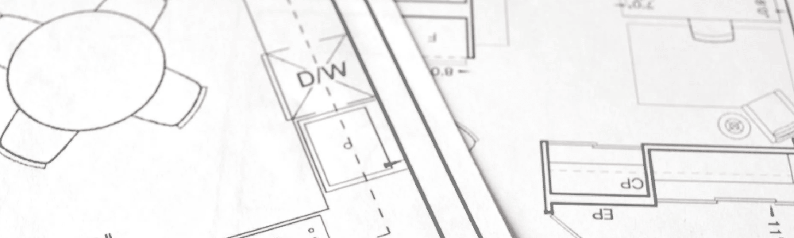

# Lista de Códigos de Obras e Construções Brasileiros

Este repositório agrupa códigos de obras e outras legislações edilícias relacionadas no estudo, planejamento, produção e construção no território brasileiro.
[Contribuições de conteúdo são encorajadas](#contribua).

O principal objetivo é agrupar e disponibilizar legislações edilícias municipais, tais como: 
 - Códigos de Obra.
 - Códigos de Licenciamento.
 - Códigos de Posturas.
 - Códigos de Urbanismo.
 - Plano Diretor.
 - Mapas e Desenhos.

Metas: 
  > Todas as capitais brasileiras.

  >Todos os municípios do Estado do Rio de Janeiro. 

Agradecimentos: 
>Duana Rodrigues.

**_Veja também:
[Códigos de Ética Brasileiros](https://github.com/fititnt/codigo-de-etica-brasil)_**

# Índice

<!-- TOC depthFrom:2 depthTo:3 -->
- [Lista de Códigos de Obras e Construções Brasileiros](#lista-de-códigos-de-obras-e-construções-brasileiros)
- [Índice](#índice)
- [Lista](#lista)
  - [Ceará](#ceará)
    - [Fortaleza](#fortaleza)
  - [Paraíba](#paraíba)
    - [João Pessoa](#joão-pessoa)
  - [Rio de Janeiro](#rio-de-janeiro)
    - [Nova Iguaçu](#nova-iguaçu)
    - [Rio de Janeiro Capital](#rio-de-janeiro-capital)
  - [São Paulo](#são-paulo)
    - [Presidente Bernardes](#presidente-bernardes)
    - [São Paulo Capital](#são-paulo-capital)
  - [Contribua](#contribua)
- [Licença](#licença)

<!-- /TOC -->

---

# Lista

## Ceará

### Fortaleza
- **[Prefeitura Municipal](https://www.fortaleza.ce.gov.br/)**

- **[Procedimentos e Licenciamentos](https://portal.seuma.fortaleza.ce.gov.br/fortalezaonline/portal/)**
>
- **[Código de Obras e Posturas de Fortaleza](https://github.com/izichtl/codigo-de-obras-do-brasil/blob/master/pdf/ce_fortaleza_obras_posturas.pdf)**
-- Data: 1981
>
- **[Código da Cidade](https://urbanismoemeioambiente.fortaleza.ce.gov.br/images/urbanismo-e-meio-ambiente/infocidade/codigo-da-cidade/lei_complementar_n_286_de_06_de_janeiro_de_2020.pdf)**
-- Data: 2019
>
- **[Plano Diretor](https://legislacao.pgm.fortaleza.ce.gov.br/index.php/Plano_Diretor)**
-- Data: 2009
>
 
## Paraíba

### João Pessoa
- **[Prefeitura Municipal](https://www.joaopessoa.pb.gov.br/)**
>
- **[Código de Obras](http://antigo.joaopessoa.pb.gov.br/portal/wp-content/uploads/2012/03/codobras.pdf)**
-- Data: 2001
>
- **[Código de Posturas](https://www.joaopessoa.pb.gov.br/wp-content/uploads/2020/07/C_digo-de-Posturas-do-Munic_pio-de-JP.pdf)**
-- Data: 1995
>

>
- **[Código de Urbanismo](http://www.planmob.joaopessoa.pb.gov.br/wp-content/uploads/2017/06/C%C3%B3digo-de-Urbanismo.pdf)**
-- Data: 2001
>
- **[Plano Diretor](http://antigo.joaopessoa.pb.gov.br/portal/wp-content/uploads/2012/04/PD-2009-versao-SEMANaRIO.pdf)**
-- Data: 2009
>

## Rio de Janeiro

### Nova Iguaçu

- **[Prefeitura Municipal](https://www.novaiguacu.rj.gov.br/)**
>
- **[Código de Obras e licenciamento](http://www.cmni.rj.gov.br/site/legislacao-municipal/leis-complementares/2015/lei-complementar-049-2015.pdf)**
-- Data: 2015
>
### Rio de Janeiro Capital

- **[Prefeitura Municipal](https://prefeitura.rio/)**
>
- **[Código de Obras e Edificações Simplificado do Município do Rio de Janeiro](https://github.com/izichtl/codigo-de-obras-do-brasil/blob/master/pdf/rj_rj_obras_edificacoes.pdf)**
-- Data: 2019
>
- **[Plano Diretor](https://www.prefeitura.sp.gov.br/cidade/secretarias/upload/desenvolvimento_urbano/apresentacao.pdf)**
-- Data: 2011

>
## São Paulo
### Presidente Bernardes

- **[Prefeitura Municipal](http://www.presidentebernardes.sp.gov.br/)**
>
- **[Código de Posturas](http://presidentebernardes.sp.gov.br/wa_files/codigo_de_posturas.pdf)**
-- Data: 2010
>
### São Paulo Capital

- **[Prefeitura Municipal](http://www.capital.sp.gov.br/)**
>
- **[Código de Obras](https://www.prefeitura.sp.gov.br/cidade/secretarias/subprefeituras/upload/pinheiros/arquivos/COE_1253646799.pdf)**
-- Data: 1975
>
- **[Plano Diretor](https://gestaourbana.prefeitura.sp.gov.br/arquivos/PDE-Suplemento-DOC/PDE_SUPLEMENTO-DOC.pdf)**
-- Data: 2011
>
- **[Código de Posturas - 1886](https://upload.wikimedia.org/wikipedia/commons/e/ec/C%C3%B3digo_de_Posturas_do_Munic%C3%ADpio_de_S%C3%A3o_Paulo.pdf)**
-- Data: 1886
>

## Contribua
Para enviar sugestões, atualizações, correções e críticas, você pode:

- Via e-mail:
  - Com o mantenedor: Ivan Zichtl <izichtl@gmail.com>.
- Via o GitHub (público):
  - [Levantar um ponto de discussão link em inglês](https://help.github.com/articles/creating-an-issue/)
  - [Sugerir alteração do código fonte link em inglês](https://help.github.com/articles/about-pull-requests/)

# Licença

[Ivan Zichtl](https://github.com/izichtl)
renunciou a todos os direitos autorais e direitos conexos ou vizinhos a este
trabalho para o [Domínio Público](UNLICENSE).